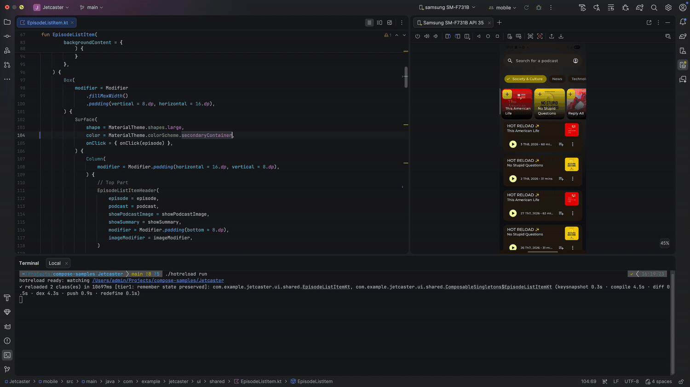
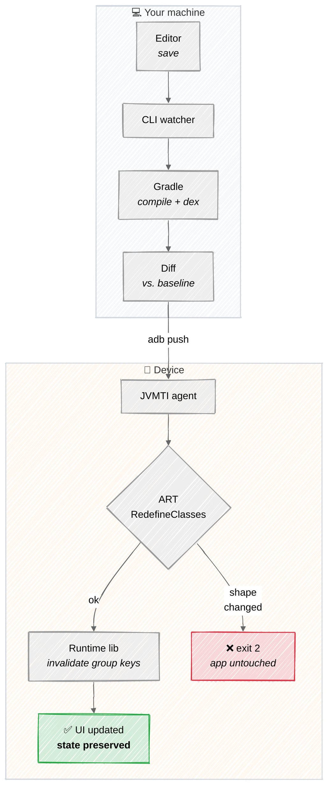

# android-hot-reload

[](https://central.sonatype.com/artifact/dev.thuat/hotreload-runtime)
[](LICENSE)

**Hot reload for Jetpack Compose on real Android devices.** Edit a composable, save, and the
running app updates in place: no reinstall, no activity restart, `remember` state preserved.

```
✓ reloaded 1 class(es) in 1980ms [tier1: remember state preserved]: com.example.FooKt
  (compile 0.8s · diff 0.0s · dex 0.7s · push 0.4s · redefine 0.1s)
```

That figure is a small single-module app. A large multi-module project with Hilt/KSP lands in
3-6s warm; see [Demo](#demo) for real numbers on one.

It works by redefining classes in the running process with a JVMTI agent, then asking Compose to
recompose only the affected scopes, the same group-key mechanism Android Studio's Live Edit
uses. Unlike Live Edit it runs from any editor, and unlike JetBrains' Compose Hot Reload it works
on Android rather than desktop JVM.

## Demo



[compose-samples/Jetcaster](https://github.com/android/compose-samples/tree/main/Jetcaster) on a
physical device, scrolled two screens deep into a podcast. Each edit changes a composable body and
is saved normally; the list keeps its scroll position across every one of them. The full session,
five edits plus the rejected structural change, is in [docs/demo.mp4](docs/demo.mp4) (1m52s).

Timings are whatever the run produced, uncut. The first reload is the slowest (~10s) because
Gradle is still cold; the rest land in 3-5s. On a large Hilt/KSP project like this one, expect
3-6s warm and ~25-30s for the very first edit after a cold Gradle daemon. Smaller files reload
faster than big ones: Kotlin recompiles a whole file for a one-character change, so a 300-line
file beats a 950-line one.

## How it works



The Gradle plugin's only job is setup: it injects the runtime library into your debug build and
turns on the Compose compiler's function-key metadata. Everything above happens per save, in the
CLI and on the device.

Two details do the heavy lifting. Changed classes are extracted from AGP's **already-merged** dex
rather than dexed in isolation: a standalone `d8` run mints different synthetic-lambda names
than the installed APK has, which ART rejects as a deleted method. And the recompose step targets
**group keys** rather than rebuilding the composition, which is why `remember` state outside the
edited file survives.

## Quickstart

**1.** Add one line to your root `build.gradle.kts`:

```kotlin
plugins { id("dev.thuat.hotreload") version "0.1.9" }
```

**2.** Get the CLI:

```bash
./gradlew hotReloadInstallCli
```

**3.** Build, install and launch your debug build as usual, then:

```bash
./hotreload run
```

Edit a composable, hit save. That's it.

<details>
<summary><b>Day-to-day commands</b></summary>

| Command | What it does |
| --- | --- |
| `./hotreload run` | watch mode: reloads on every save |
| `./hotreload bootstrap` | re-attach after the app restarts (the agent doesn't survive a process death) |
| `./hotreload cycle --file path/to/File.kt` | reload once, for scripting |

Any flag you pass overrides the baked-in defaults, e.g. `./hotreload run --serial emulator-5554`.

`./hotreload` is generated by `hotReloadInstallCli` with your project path, `applicationId`, and
(when resolvable) your Android SDK location baked in, and is rewritten on every run. Add
`/hotreload` and `/.hotreload/` to `.gitignore`.
</details>

<details>
<summary><b>Installing the CLI globally instead</b></summary>

If you want one `hotreload` command on your `PATH` shared across projects, rather than a
per-project wrapper:

```bash
curl -fsSL https://raw.githubusercontent.com/nthuat/android-hot-reload/main/install.sh | sh
```

It installs to `~/.local/share/hotreload/<version>/` and symlinks `~/.local/bin/hotreload`.
Re-run it to upgrade; pin with `HOTRELOAD_VERSION=v0.1.9`.

Note this fetches the *latest* release, so it can drift from your plugin version. The CLI checks
the on-device runtime version and refuses to run on a mismatch rather than failing silently, but
`hotReloadInstallCli` is the option that can't drift in the first place.
</details>

<details>
<summary><b>What applying at the root actually does</b></summary>

The plugin reacts to each subproject's own `com.android.application` / `com.android.library`
plugin and wires it up: the application module gets the runtime library injected into
`debugImplementation`, and *every* Android module (app and libraries alike) gets the Compose
compiler's function-key metadata enabled.

That last part matters. Function-key metadata is what makes tier-1 (state-preserving) reloads
work; a module missing it silently degrades to tier 2, rebuilding the whole composition and
losing `remember` state. Applying once at the root means you can't forget a module.

The runtime library's coordinate is derived from wherever the plugin resolved itself from, so
there's nothing to configure. `hotreload.runtimeCoordinate.set(...)` is available at the root as
an override for repository layouts it can't auto-detect.

**Per-module application still works** if you'd rather opt modules in explicitly: declare the
version once in the root with `apply false`, then apply it without a version in each module that
has composables (omitting the version fails with `gradle-plugin:null`):

```kotlin
// root build.gradle.kts
plugins { id("dev.thuat.hotreload") version "0.1.9" apply false }

// app/build.gradle.kts, feature/build.gradle.kts, … (each module with composables)
plugins { id("dev.thuat.hotreload") }
```

Mixing both styles is safe: the plugin is idempotent and won't double-configure a module.
</details>

<details>
<summary><b>CLI details, JDK requirements, troubleshooting</b></summary>

The `cli.zip` bundles the JVMTI agent for `arm64-v8a` and `x86_64`, so there's no
`--agent-so-dir` to set. Needs JDK 17+ to run. `hotReloadInstallCli` unpacks it to
`build/hotreload/cli/`; the raw binary at `build/hotreload/cli/bin/cli` is still runnable
directly with your own `--project`/`--package` if you'd rather skip the wrapper. Re-running the
task is a no-op once the matching version is present.

**JDK too new?** The CLI runs your project's Gradle build on its own JVM, and Gradle refuses to
run on a JDK newer than it supports, with a famously unhelpful error that is just a version
number. The CLI checks this up front and tells you what to do:

```
✗ environment: JDK 26 is too new for Gradle 8.11.1, which supports up to JDK 23…
  → export JAVA_HOME=$(/usr/libexec/java_home -v 21)
  → or: --java-home <path>
```

`--java-home` points only this tool at a different JDK, without touching your shell.

**Configuration cache.** The CLI builds with Gradle's configuration cache on by default, which
cuts repeat-cycle compile time substantially on larger projects; it falls back automatically for a
project whose plugins turn out to be incompatible with it, or disable it yourself with
`--no-configuration-cache`.

**Progress output.** `cycle`/`run` print a live "compiling…", "dexing…", "pushing…" line as each
phase starts, so a slow reload is not a silent terminal. On a real terminal, each phase
overwrites the last in place; piped or redirected output (CI, `| grep`, the e2e script) gets
plain lines instead, so logs stay greppable. Auto-detected from whether stdout is a terminal;
override with `--progress` or `--no-progress`. The final `reloaded`/`compile error`/etc. line is
unaffected either way.

**Version matching.** The CLI and the on-device runtime speak a private protocol that changes
between releases, so keep them on the same version. `hotReloadInstallCli` guarantees it; with
`install.sh`, pin via `HOTRELOAD_VERSION`. The CLI verifies this itself on every
`bootstrap`/`cycle`: exit 3 naming both versions on a real mismatch, and a warning (not a
failure) if the runtime predates the check.

**Manual install.** Grab `cli.zip` from the [latest release](../../releases) and unzip it.
</details>

## Status

`0.1.9`: composable **body** reloads. See [Supported / unsupported changes](#supported--unsupported-changes)
for the exact boundary.

**Verified against:**

| | Versions |
| --- | --- |
| Android Gradle Plugin | 8.7 and 9.2 (AGP 9 moved Kotlin's class output; both layouts handled) |
| Kotlin | 2.1 and 2.4 |
| Compose runtime | 1.7 and 1.11 (both reach tier 1; see [Reload tiers](#reload-tiers)) |
| Device | API 26+: physical arm64 (Samsung SM-F731B, Android 15) and x86_64 emulator |
| App `minSdk` | any; the runtime library declares 21, hot reload needs an API 26+ *device* |

Exercised on this repo's `sample/`, a real third-party multi-module app, and Google's
[compose-samples/JetNews](https://github.com/android/compose-samples). A typical reload is ~3-4s
on a small app, ~8s on JetNews. `e2e/run-e2e.sh` covers the golden path and the
incompatible-change rejection path, and runs on every push.

## Supported / unsupported changes

| Change | Reloads? |
| --- | :---: |
| Edit a composable function's body | ✅ |
| Edit a non-composable function's body | ✅ |
| Edit a file containing `@Preview` functions | ✅ |
| Add or remove a function, method, or field | ❌ |
| Change a function signature | ❌ |
| Add or remove a class | ❌ |

The ❌ rows are ART's `RedefineClasses` restrictions, not ours: class *shape* can't change. Those
exit with code 2 and a message telling you to rebuild; the app keeps running its old code rather
than ending up half-swapped.

**`remember` state** survives a reload everywhere except inside the edited file itself, whose
scopes re-execute fresh against the new bytecode. This matches Live Edit. If some state must
survive edits to its own file, hoist it to a `ViewModel` or the `Activity`.

**Side effects in the edited file re-run**, which is the same rule seen from the other end and
worth stating plainly because it surprises people. Re-executing a scope also re-runs its
`LaunchedEffect`/`DisposableEffect`, so anything they drive restarts: in-progress media playback
returns to the start, network calls fire again, animations reset. Observed on Jetcaster, where
editing the player screen while audio was playing reset playback to `00:00` even though the
reload correctly reported tier 1. Editing a *different* file leaves those effects untouched.

<details>
<summary><b>Not-yet-loaded classes (e.g. `@Preview` lambda holders)</b></summary>

A changed class that was already in the baseline snapshot (so it's known to exist in the
installed APK, never a brand-new class; that case is still rejected above) but isn't currently
loaded in the running process is **skipped**, not treated as a failure. The most common case:
the Compose compiler emits a `ComposableSingletons$<File>Kt$lambda-N$1` holder class per
composable lambda in a file, including ones used only by `@Preview` functions; those never run
outside Android Studio/Paparazzi, so the app process never loads them, and any edit that shifts
lambda numbering in the file used to fail the *entire* reload with a bogus "rebuild" demand.

Skipping is safe: nothing running is using that class, so nothing can desync. If it's ever
loaded later (e.g. you start using that lambda for real), it loads the APK's original bytes,
stale until the next full rebuild. Exit code stays 0; the CLI prints a short extra line naming
how many classes were skipped. If *every* changed class in a cycle was skipped, the CLI prints a
distinct "nothing applied" line instead of a reload line (still exit 0: nothing broke, nothing
changed either).
</details>

<a id="reload-tiers"></a>
<details>
<summary><b>Reload tiers</b></summary>

Each reload picks the strongest tier that succeeds, logged at tag `HotReload`:

1. **`tier1: group-key invalidation`**. Recomposes only the scopes belonging to the redefined
   class's Compose group keys. Preserves `remember` state everywhere else in the composition.
   The keys are read from the changed `.class` bytecode on your machine and sent with the reload:
   Compose 1.11 emits `@FunctionKeyMeta` with `BINARY` retention directly on methods, which
   on-device reflection cannot see, so extracting them host-side is what makes tier 1 work on
   current Compose as well as older versions.
2. **`tier2: whole-composition rebuild via HotReloader`**. Falls back to disposing and
   rebuilding the entire composition when group-key invalidation isn't reachable. Loses all
   `remember` state, not just the edited scope's.
3. **`tier3: recreating <Activity>`**. Last resort: a full `Activity.recreate()`.

Run `adb logcat -s HotReload` during a reload to see which tier actually fired.
</details>

<details>
<summary><b>Phase timings</b></summary>

Every successful reload line ends with a compact per-phase breakdown: `compile`, `diff`
(baseline snapshot/diff), `dex` (splitting a changed class back out of AGP's merged dex
output), `push` (adb push + run-as copy), `redefine` (the agent round trip). For example:

```
✓ reloaded 1 class(es) in 1980ms [tier1: remember state preserved]: com.example.FooKt
  (compile 0.8s · diff 0.0s · dex 0.7s · push 0.4s · redefine 0.1s)
```

Always on, no flag needed: a slow cycle is diagnosable straight from its normal output instead
of needing to be re-measured after the fact.
</details>

## Requirements

- A **debuggable build**: JVMTI attach and `RedefineClasses` both require it.
- A device or emulator on **API 26+**. Your app's own `minSdk` can be lower (verified at 23);
  the floor applies to the device attaching the agent, not your APK.
- `ANDROID_HOME` (with `platform-tools` on it) only if `hotReloadInstallCli` couldn't resolve your
  SDK location itself; the generated `./hotreload` bakes it in when it could.

<details>
<summary><b>Build-setup details</b></summary>

**AGP 8.x or 9.x.** The two place Kotlin's class output in different locations (AGP 9 uses the
built-in Kotlin compiler); the CLI probes both and uses whichever exists. Verified against AGP
8.7.3 / Kotlin 2.1.0 and AGP 9.3.1 / Kotlin 2.4.10 / Gradle 9.5.

**A single top-level application module**, defaulting to `:app`. Pass `--app-module` if yours has
a different Gradle path.

**Contributing to this repo** needs a JDK 21 installed somewhere;
`gradle/gradle-daemon-jvm.properties` makes Gradle select it, so your `JAVA_HOME` can point
anywhere. See [`docs/CONTRIBUTING.md`](docs/CONTRIBUTING.md).
</details>

## License

Apache-2.0. See [`LICENSE`](LICENSE).

`agent/src/main/cpp/include/jvmti.h` is vendored, unmodified, from the AOSP ART runtime
(originally OpenJDK's `jvmti.h`) and is licensed under the GNU General Public License v2.0
with the Classpath exception; see `agent/LICENSE-jvmti-header.md` for provenance and why
that doesn't extend to `libhotreload_agent.so` itself (interface declarations only, nothing
GPL-licensed is linked in).
