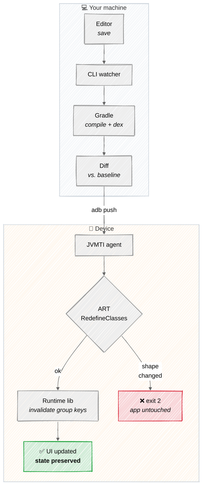

# android-hot-reload

[](https://central.sonatype.com/artifact/dev.thuat/hotreload-runtime)
[](LICENSE)

**Hot reload for Jetpack Compose on real Android devices.** Edit a composable, save, and the
running app updates in place — no reinstall, no activity restart, `remember` state preserved.

```
✓ reloaded 1 class(es) in 1980ms [tier1 — remember state preserved]: com.example.FooKt
  (compile 0.8s · diff 0.0s · dex 0.7s · push 0.4s · redefine 0.1s)
```

It works by redefining classes in the running process with a JVMTI agent, then asking Compose to
recompose only the affected scopes — the same group-key mechanism Android Studio's Live Edit
uses. Unlike Live Edit it runs from any editor, and unlike JetBrains' Compose Hot Reload it works
on Android rather than desktop JVM.

## Quickstart

**1. Apply the plugin at your root project** — that's the only Gradle change, even for
multi-module builds:

```kotlin
// root build.gradle.kts
plugins { id("dev.thuat.hotreload") version "0.1.5" }
```

**2. Install the CLI:**

```bash
curl -fsSL https://raw.githubusercontent.com/nthuat/android-hot-reload/main/install.sh | sh
```

**3. Build, install and launch your debug build as usual**, then:

```bash
hotreload run --project . --package your.app.package
```

Edit a composable, hit save. That's it.

<details>
<summary><b>What applying at the root actually does</b></summary>

The plugin reacts to each subproject's own `com.android.application` / `com.android.library`
plugin and wires it up: the application module gets the runtime library injected into
`debugImplementation`, and *every* Android module — app and libraries alike — gets the Compose
compiler's function-key metadata enabled.

That last part matters. Function-key metadata is what makes tier-1 (state-preserving) reloads
work; a module missing it silently degrades to tier 2, rebuilding the whole composition and
losing `remember` state. Applying once at the root means you can't forget a module.

The runtime library's coordinate is derived from wherever the plugin resolved itself from, so
there's nothing to configure. `hotreload.runtimeCoordinate.set(...)` is available at the root as
an override for repository layouts it can't auto-detect.

**Per-module application still works** if you'd rather opt modules in explicitly — declare the
version once in the root with `apply false`, then apply it without a version in each module that
has composables (omitting the version fails with `gradle-plugin:null`):

```kotlin
// root build.gradle.kts
plugins { id("dev.thuat.hotreload") version "0.1.5" apply false }

// app/build.gradle.kts, feature/build.gradle.kts, … (each module with composables)
plugins { id("dev.thuat.hotreload") }
```

Mixing both styles is safe — the plugin is idempotent and won't double-configure a module.
</details>

<details>
<summary><b>CLI details and other install methods</b></summary>

`install.sh` puts the latest release in `~/.local/share/hotreload/<version>/` and symlinks
`~/.local/bin/hotreload`. Re-run it to upgrade. Pin a version with
`HOTRELOAD_VERSION=v0.1.5 curl ... | sh`.

Besides `run` (watch mode), the CLI has `bootstrap` (attach once) and `cycle --file path/to/File.kt`
(reload once) for scripting. Requires JDK 17+ on `PATH`/`JAVA_HOME`. The 17.7 MB download bundles
the JVMTI agent for `arm64-v8a` and `x86_64`, so there's no `--agent-so-dir` to set.

The build daemon for your project runs on the CLI's own JVM by default, which fails fast with an
actionable message if it's too new for your project's Gradle version (most default JDKs are 22+
now, and Gradle needs a specific-enough version to run at all — see the JDK-Gradle compatibility
table in Gradle's docs). Fix it with `export JAVA_HOME=$(/usr/libexec/java_home -v 21)` (macOS) or
point just this tool at a different JDK with `--java-home <path>`, without touching your shell.

**Gradle task** — `./gradlew hotReloadInstallCli` downloads the release matching this project's
plugin version, so the CLI can't drift from the plugin, and unpacks it to `build/hotreload/cli/`.
Requires plugin **0.1.5+**.

**Manual** — grab `cli.zip` from the [latest release](../../releases) and unzip it.
</details>

## Status

`0.1.5` — composable **body** reloads. See [Supported / unsupported changes](#supported--unsupported-changes)
for the exact boundary.

Verified end to end on an API 34 x86_64 emulator and a physical arm64 device (Samsung SM-F731B,
Android 15), against this repo's `sample/` project and a real third-party multi-module Compose
app, where a typical reload is ~4s. `e2e/run-e2e.sh` covers the golden path and the
incompatible-change rejection path, and runs on every push.

## Supported / unsupported changes

| Change | Reloads? |
| --- | :---: |
| Edit a composable function's body | ✅ |
| Edit a non-composable function's body | ✅ |
| Edit a file containing `@Preview` functions | ✅ |
| Add or remove a function, method, or field | ❌ |
| Change a function signature | ❌ |
| Add or remove a class | ❌ |

The ❌ rows are ART's `RedefineClasses` restrictions, not ours — class *shape* can't change. Those
exit with code 2 and a message telling you to rebuild; the app keeps running its old code rather
than ending up half-swapped.

**`remember` state** survives a reload everywhere except inside the edited file itself, whose
scopes re-execute fresh against the new bytecode. This matches Live Edit. If some state must
survive edits to its own file, hoist it to a `ViewModel` or the `Activity`.

<details>
<summary><b>Not-yet-loaded classes (e.g. `@Preview` lambda holders)</b></summary>

A changed class that was already in the baseline snapshot (so it's known to exist in the
installed APK — never a brand-new class; that case is still rejected above) but isn't currently
loaded in the running process is **skipped**, not treated as a failure. The most common case:
the Compose compiler emits a `ComposableSingletons$<File>Kt$lambda-N$1` holder class per
composable lambda in a file, including ones used only by `@Preview` functions — those never run
outside Android Studio/Paparazzi, so the app process never loads them, and any edit that shifts
lambda numbering in the file used to fail the *entire* reload with a bogus "rebuild" demand.

Skipping is safe: nothing running is using that class, so nothing can desync. If it's ever
loaded later (e.g. you start using that lambda for real), it loads the APK's original bytes —
stale until the next full rebuild. Exit code stays 0; the CLI prints a short extra line naming
how many classes were skipped. If *every* changed class in a cycle was skipped, the CLI prints a
distinct "nothing applied" line instead of a reload line (still exit 0 — nothing broke, nothing
changed either).
</details>

<details>
<summary><b>Reload tiers</b></summary>

Each reload picks the strongest tier that succeeds, logged at tag `HotReload`:

1. **`tier1: group-key invalidation`** — recomposes only the scopes belonging to the redefined
   class's Compose group keys. Preserves `remember` state everywhere else in the composition.
2. **`tier2: whole-composition rebuild via HotReloader`** — falls back to disposing and
   rebuilding the entire composition when group-key invalidation isn't reachable. Loses all
   `remember` state, not just the edited scope's.
3. **`tier3: recreating <Activity>`** — last resort, a full `Activity.recreate()`.

Run `adb logcat -s HotReload` during a reload to see which tier actually fired.
</details>

<details>
<summary><b>Phase timings</b></summary>

Every successful reload line ends with a compact per-phase breakdown — `compile`, `diff`
(baseline snapshot/diff), `dex` (splitting a changed class back out of AGP's merged dex
output), `push` (adb push + run-as copy), `redefine` (the agent round trip) — e.g.:

```
✓ reloaded 1 class(es) in 1980ms [tier1 — remember state preserved]: com.example.FooKt
  (compile 0.8s · diff 0.0s · dex 0.7s · push 0.4s · redefine 0.1s)
```

Always on, no flag needed — a slow cycle is diagnosable straight from its normal output instead
of needing to be re-measured after the fact.
</details>

## How it works



The Gradle plugin's only job is setup: it injects the runtime library into your debug build and
turns on the Compose compiler's function-key metadata. Everything above happens per save, in the
CLI and on the device.

Two details do the heavy lifting. Changed classes are extracted from AGP's **already-merged** dex
rather than dexed in isolation — a standalone `d8` run mints different synthetic-lambda names
than the installed APK has, which ART rejects as a deleted method. And the recompose step targets
**group keys** rather than rebuilding the composition, which is why `remember` state outside the
edited file survives.

## Requirements

- `ANDROID_HOME`/`ANDROID_SDK_ROOT` set, with `platform-tools` on it.
- A debuggable build (JVMTI attach and `RedefineClasses` both require it).
- Device or emulator API 26+ (JVMTI `RedefineClasses` support); the app's own `minSdk` can be
  lower (verified down to 23) — the API 26 floor is the device attaching the agent, not the APK.
- AGP 8.x (Kotlin-Gradle-Plugin Kotlin compilation) or AGP 9.x (built-in Kotlin compiler) — the
  CLI's class-output discovery (`ModuleResolver.classDirsOf`) probes both layouts and picks
  whichever exists. Verified against AGP 8.7.3/Kotlin 2.1.0 (this repo's own sample) and AGP
  9.3.1/Kotlin 2.4.10/Gradle 9.5 (Google's `compose-samples/JetNews`).
- A conventional single top-level application module, default `:app` — override with
  `--app-module` if your app module has a different Gradle path.
- Building this repo requires a JDK 21 installed somewhere — `gradle/gradle-daemon-jvm.properties`
  makes Gradle select it automatically, so `JAVA_HOME` can point anywhere. (Gradle 8.11.1 refuses
  to run on JDK 22+, and its error is a bare version number like `26.0.2`, so this is worth
  keeping.)

## License

Apache-2.0 — see [`LICENSE`](LICENSE).

`agent/src/main/cpp/include/jvmti.h` is vendored, unmodified, from the AOSP ART runtime
(originally OpenJDK's `jvmti.h`) and is licensed under the GNU General Public License v2.0
with the Classpath exception — see `agent/LICENSE-jvmti-header.md` for provenance and why
that doesn't extend to `libhotreload_agent.so` itself (interface declarations only, nothing
GPL-licensed is linked in).
